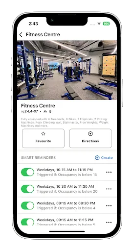
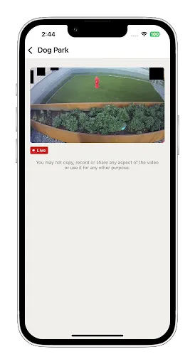
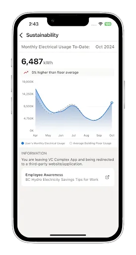
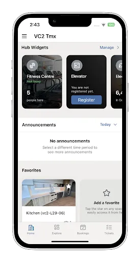
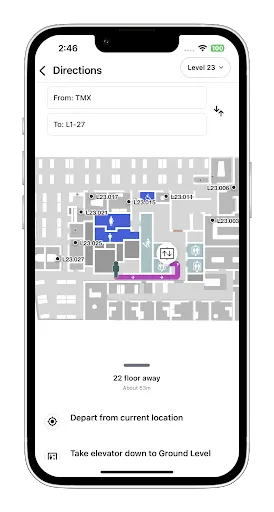
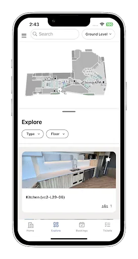

## AtWork
**Category:** Enterprise / Smart Workplace 

---

## 🧩 Overview {#overview}

**AtWork** is an advanced indoor navigation iOS application designed for enterprise environments to improve workplace efficiency and promote sustainability. The app enables employees and visitors to seamlessly navigate across company buildings, floors, and rooms using interactive indoor maps powered by MappedIn.

Beyond navigation, AtWork integrates smart workplace features such as meeting room booking, real-time indoor camera streaming, and energy consumption monitoring across different areas—helping organizations optimize space usage and encourage energy-saving practices. access to company-approved and licensed tools—including paid applications and AI-based services tailored for internal use.

---

## 📱 Screenshots {#screenshots}

  
  
  
  
  
  

## 🧰 Technology Stack {#tech}

UIKit

Dependency Injection

MappedIn Framework

Datadog (performance monitoring and analysis)

Indoor geospatial interactions

URLSession / RESTful APIs

Microsoft Authentication

Push Notifications

MVVM / Clean Architecture

Floor and room-level navigation

Room Booking System

---
## ⭐ Key Features {#features}

- Indoor navigation across buildings, floors, and rooms
- Interactive geospatial maps powered by MappedIn
- Meeting room discovery and booking system
- Energy consumption monitoring by area and floor
- Integration with internal camera streaming for live views
- Real-time notifications and updates
- Enterprise-focused performance monitoring and analytics
- Company announcements, news, and exclusive offers
- Secure authentication and enterprise-grade data privacy
- Modular architecture for scalability and maintainability
