## Thiqati
**Category:** Enterprise Application  
**Availability:** Internal Enterprise Distribution  
[View on App Store →](#)

---

## 🧩 Overview

**Thiqati** is an enterprise-focused mobile application designed to streamline internal operations and enhance employee engagement within large organizations.

The app centralizes multiple employee services into a single platform, enabling teams to manage attendance, submit service requests, stay informed with company announcements, and interact through a built-in community feed—creating a more connected and efficient workplace experience.

---

## 📱 Screenshots

  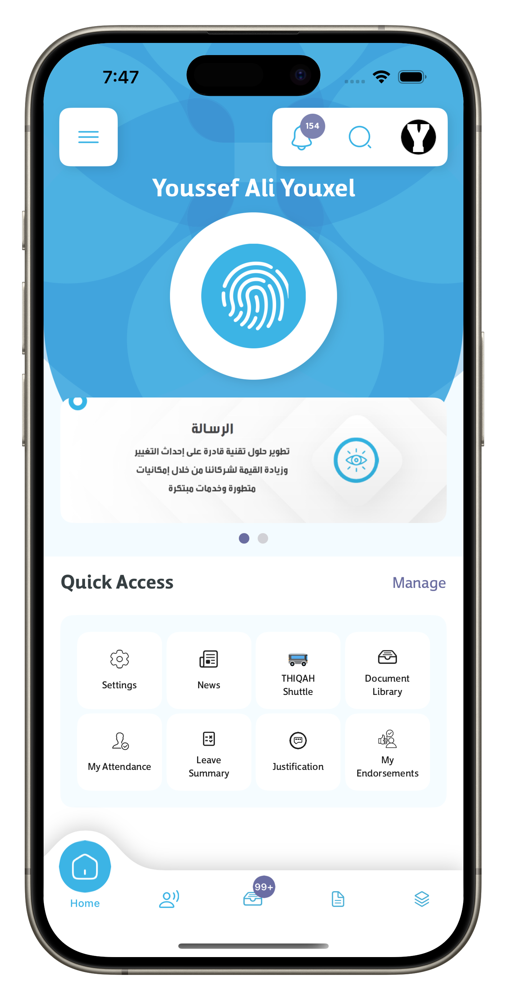
  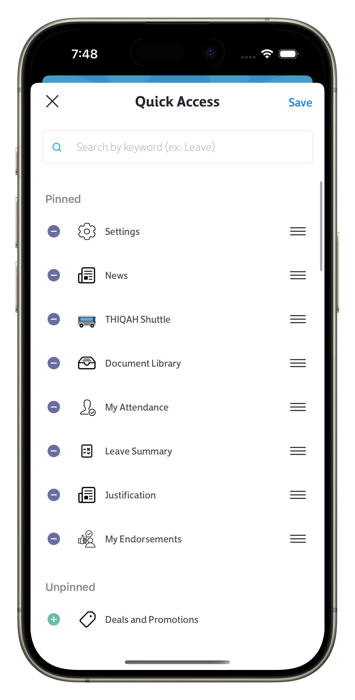
  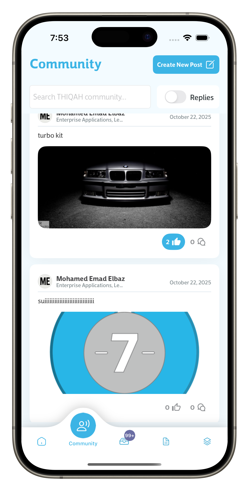
  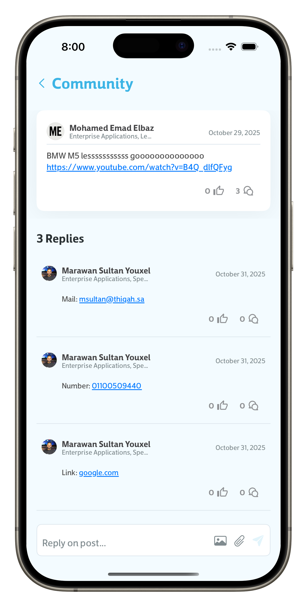
  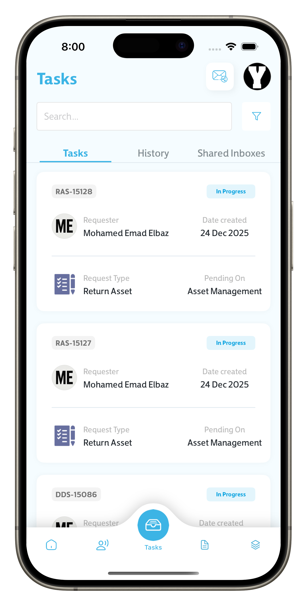
  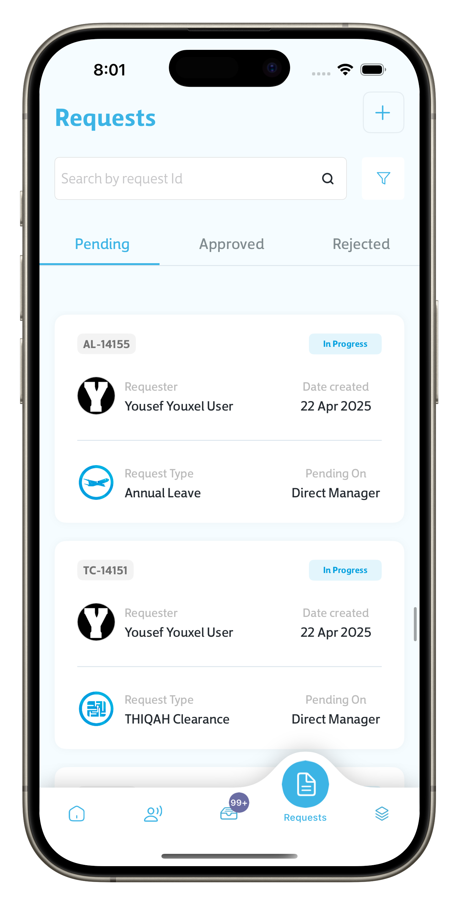
  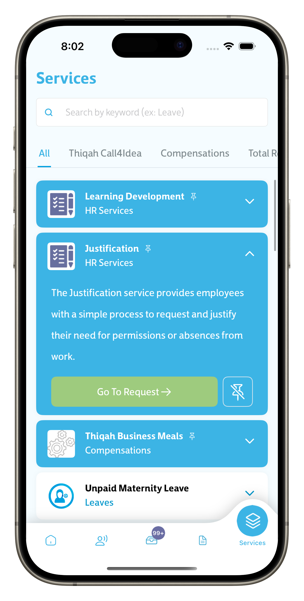
  
  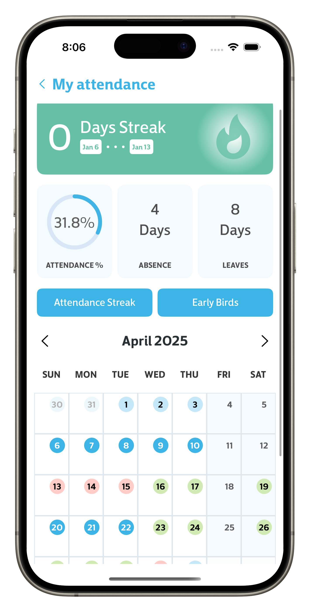
  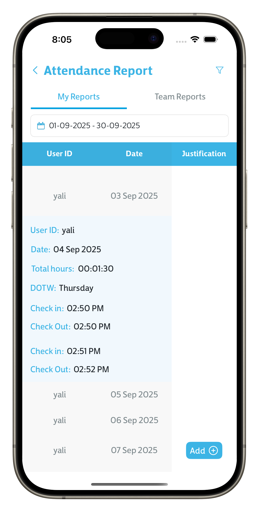
  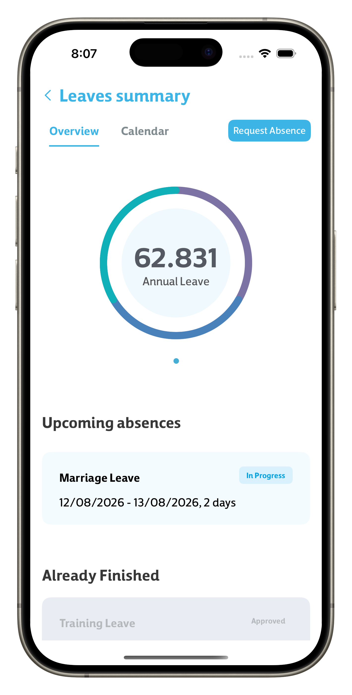
  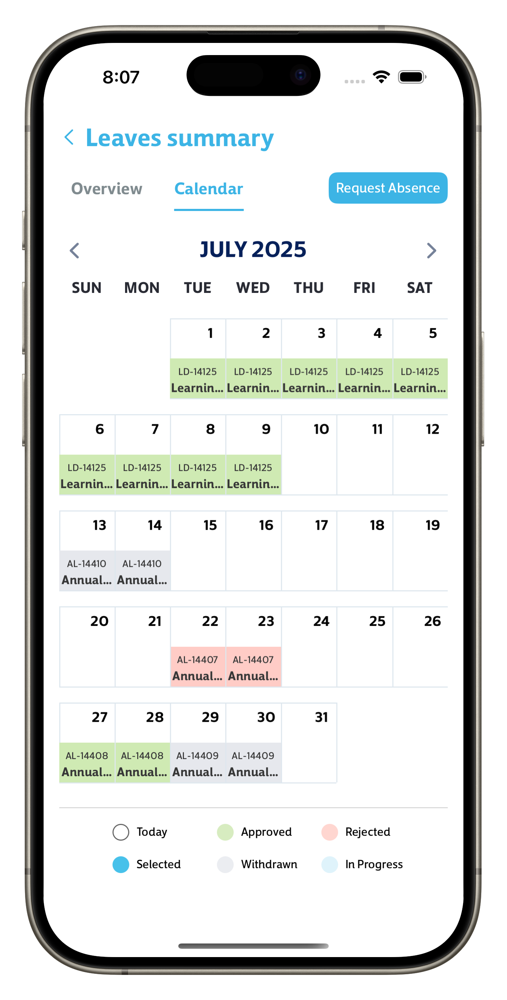

---

## 🧰 Technology Stack

### iOS
- Swift
- UIKit
- SwiftUI (hybrid usage)
- Combine
- Auto Layout

### Architecture & Patterns
- MVVM
- Clean Architecture
- Protocol-Oriented Programming
- Dependency Injection

### Networking & Data
- RESTful APIs
- URLSession
- Codable
- Asynchronous Programming
- Secure API Key Management

### Backend & Services
- Azure Cloud Messaging
- Push Notifications
- Secure Authentication
- Role-Based Access Control

---

## ⭐ Key Features

- Attendance management with check-in / check-out workflows
- Employee service request system with dynamic forms
- Community feed for internal communication and engagement
- Company announcements, news, and exclusive offers
- Secure authentication and enterprise-grade data privacy
- Modular architecture for scalability and maintainability

